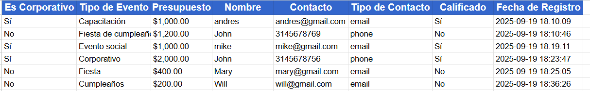

#  Talkative Agent - Sistema de Calificación de Leads

Un agente conversacional inteligente que califica leads para eventos corporativos y los guarda automáticamente en Google Sheets.

## Instalación y configuración

### Paso 1: Clonar el repositorio
```bash
git clone https://github.com/andresfeliper3/talkative-agent.git
cd talkative-agent
```

### Paso 2: Crear entorno virtual
```bash
# Windows
python -m venv venv
venv\Scripts\activate

# macOS/Linux
python3 -m venv venv
source venv/bin/activate
```

### Paso 3: Instalar dependencias
```bash
pip install -r requirements.txt
```

### Paso 4: Configurar variables de entorno
```bash
# Copia el archivo de ejemplo
cp env.example .env

# Edita el archivo .env con tu API key de OpenAI
# OPENAI_API_KEY=sk-tu-api-key-aqui
```


**Nota:** El token de OpenAI es opcional. Si no lo configuras, el sistema usará clasificación manual en lugar de IA.

### Paso 5: Configurar Google Sheets API
1. Ve a [Google Cloud Console](https://console.cloud.google.com/)
2. Crea un nuevo proyecto o selecciona uno existente
3. Habilita la **Google Sheets API**
4. Ve a **"APIs & Services"** > **"Credentials"**
5. Haz clic en **"Create Credentials"** > **"OAuth client ID"**
6. Selecciona **"Desktop application"**
7. Completa el nombre de la aplicación
8. Descarga el archivo JSON
9. Renómbralo a `credentials.json`
10. Colócalo en `src/credentials/credentials.json`

### Paso 6: Primera ejecución
```bash
cd src
python main.py
```
- Se abrirá automáticamente el navegador
- Inicia sesión con tu cuenta de Google
- Autoriza el acceso a Google Sheets
- Se creará automáticamente `token.json`

### Paso 7: ¡Listo para usar!
```bash
python main.py
```

##  Cómo ejecutar el agente

Una vez completada la instalación y configuración:

```bash
cd src
python main.py
```

El agente iniciará la conversación automáticamente y te guiará a través del proceso de calificación de leads.

##  Ejemplos de uso

###  Caso Calificado
```
¡Hola! 👋

Bienvenido a nuestro sistema de calificación de eventos corporativos...

¿Tu evento es corporativo?
1. Sí - Es un evento corporativo
2. No - No es un evento corporativo
3. Describe tu evento para que podamos clasificarlo

Selecciona una opción (1/2/3 o sí/no/describir): 1

¿Qué tipo de evento corporativo quieres organizar? Conferencia de tecnología

¿Cuál es tu presupuesto estimado en USD?
Respuesta: 5000

Perfecto. ¿Me compartes tu nombre y un email o teléfono de contacto?
Nombre: Juan Pérez
Email o teléfono de contacto: juan.perez@empresa.com

--- Evaluando tu solicitud ---
¡Perfecto!
```

### Caso No Calificado
```
¡Hola! 👋

Bienvenido a nuestro sistema de calificación de eventos corporativos...

¿Tu evento es corporativo?
1. Sí - Es un evento corporativo
2. No - No es un evento corporativo
3. Describe tu evento para que podamos clasificarlo

Selecciona una opción (1/2/3 o sí/no/describir): 2

¿Qué tipo de evento quieres organizar? Boda familiar

¿Cuál es tu presupuesto estimado en USD?
Respuesta: 800

Perfecto. ¿Me compartes tu nombre y un email o teléfono de contacto?
Nombre: María García
Email o teléfono de contacto: maria@email.com

--- Evaluando tu solicitud ---
Lo sentimos, nuestro trabajo se enfoca principalmente en eventos corporativos.
```

## Captura de pantalla - Google Sheets

El sistema crea automáticamente una hoja de cálculo con diseño elegante:



### Estructura de la hoja:
- **Es Corporativo**: Sí/No
- **Tipo de Evento**: Tipo específico del evento
- **Presupuesto**: Presupuesto en USD
- **Nombre**: Nombre del contacto
- **Contacto**: Email o teléfono
- **Tipo de Contacto**: email/phone
- **Calificado**: Sí/No
- **Fecha de Registro**: Timestamp automático

## Características técnicas

- **Detección automática** de tipo de evento (corporativo vs. no corporativo)
- **Validación inteligente** de presupuesto mínimo ($1,000 USD)
- **Detección automática** de tipo de contacto (email/teléfono)
- **Prevención de duplicados** en Google Sheets
- **Renovación automática** de tokens OAuth2
- **Interfaz conversacional** intuitiva

## Estructura del proyecto

```
talkative-agent/
├── src/
│   ├── main.py                 # Punto de entrada
│   ├── config.py              # Configuración y mensajes
│   ├── flow/
│   │   └── graph.py           # Flujo conversacional
│   ├── models/
│   │   └── state.py           # Modelo de datos
│   ├── services/
│   │   ├── google_sheets.py   # Integración con Google Sheets
│   │   └── llm_classifier.py  # Clasificación con IA
│   ├── utils/
│   │   └── validators.py      # Validadores de entrada
│   ├── credentials/           # Credenciales OAuth2
│   │   ├── credentials.json   # Configuración OAuth2
│   │   ├── token.json        # Token de acceso
│   │   └── README.md         # Guía de configuración
│   └── prompts/
│       └── event_classification.md  # Prompt para IA
├── docs/
│   └── sheets-screenshot.png  # Captura de pantalla
├── env.example               # Variables de entorno de ejemplo
├── .env                     # Variables de entorno (crear manualmente)
├── requirements.txt         # Dependencias de Python
└── README.md               # Este archivo
```

## Requisitos

- Python 3.8+
- Google Cloud Console (para credenciales OAuth2)
- Cuenta de Google con acceso a Google Sheets
- **Hoja de Google Sheets**: ID `181M0QYYtFhEXB39Qal_htrYe5vI8hCFOdna3mglyGZQ` (configurable)
- **OpenAI API Key** (opcional): Para clasificación automática con IA

## Configuración de Google Sheets

### Usar la hoja por defecto
El sistema está configurado para usar automáticamente la hoja con ID: `181M0QYYtFhEXB39Qal_htrYe5vI8hCFOdna3mglyGZQ`

### Usar tu propia hoja
Si quieres usar tu propia hoja de Google Sheets:

1. **Crea una nueva hoja** en Google Sheets
2. **Copia el ID** desde la URL: `https://docs.google.com/spreadsheets/d/[ID_AQUI]/edit`
3. **Modifica el archivo** `src/services/google_sheets.py`:
   ```python
   # Línea 22 - Cambia este ID por el de tu hoja
   self.SPREADSHEET_ID = "TU_ID_DE_HOJA_AQUI"
   ```
4. **Comparte la hoja** con la cuenta de Google que usaste para autenticación
5. **Dale permisos de Editor** a la cuenta

### Estructura de la hoja
- **Nombre de la pestaña**: Cualquier nombre (el sistema detecta automáticamente la primera pestaña)
- **Headers**: Se crean automáticamente en la primera fila
- **Formato**: Se aplica automáticamente (colores, negrita, centrado)

## Documentación adicional
- [Guía de credenciales](src/credentials/README.md)
- [Configuración de OpenAI](#configuración-de-openai)

## Configuración de OpenAI

### Obtener API Key
1. Ve a [OpenAI Platform](https://platform.openai.com/api-keys)
2. Inicia sesión con tu cuenta de OpenAI
3. Haz clic en **"Create new secret key"**
4. Copia la API key generada

### Configurar en el proyecto
1. Copia `env.example` a `.env`:
   ```bash
   cp env.example .env
   ```

2. Edita el archivo `.env`:
   ```bash
   OPENAI_API_KEY=sk-tu-api-key-real-aqui
   ```

3. Guarda el archivo

### Funcionalidad con OpenAI
- **Con API key**: El sistema usa IA para clasificar automáticamente si un evento es corporativo
- **Sin API key**: El sistema usa clasificación manual (el usuario debe responder sí/no)

### Costos
- La API de OpenAI tiene costos por uso
- Para desarrollo/testing, los costos son mínimos
- Consulta los precios en: [https://openai.com/pricing](https://openai.com/pricing)


